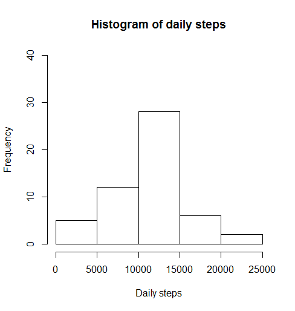

```{r setup, include=FALSE}
knitr::opts_chunk$set(echo = TRUE)
```
#Loading and preprocessing the data

1. Reading data from .csv file
```{r}
data = read.csv("activity.csv", header=TRUE)
head(data)
```

#What is mean total number of steps taken per day?

2. Histogram of the total number of steps taken each day
```{r}
par(mfrow=c(1,1))
daily_steps <- tapply(data$steps, data$date, sum)
hist(daily_steps, main="Histogram of daily steps", xlab="Daily steps", ylim=c(0, 40))
```

3. Mean and median number of steps taken each day
```{r}
mean <- mean(tapply(data$steps, data$date, sum, na.rm=TRUE))
mean

median <- median(tapply(data$steps, data$date, sum, na.rm=TRUE))
median
```

#What is the average daily activity pattern?

4.Time series plot of the average number of steps taken
```{r}
mean_daily_steps <- tapply(data$steps, data$date, mean, na.rm=TRUE)
ts_mds <- ts(mean_daily_steps)
plot(ts_mds[!is.na(ts_mds)], type="l", main="Time series of the mean daily steps", xlab="Day", ylab="Mean daily steps", ylim=c(0,80))
```


5. The 5-minute interval that, on average, contains the maximum number of steps
```{r}
interval_steps <- tapply(data$steps, data$interval, mean, na.rm=TRUE)
interval_steps[which.max(interval_steps)]
```
The 835th 5-minute interval of the day contains 206.1698 steps on average an this is the maximun number of steps on average.

#Imputing missing values

6. Code to describe and show a strategy for imputing missing data
```{r}
length(which(is.na(data)))
```
The data contains 2304 missing values, these were filled in a day with the mean daily steps.

7. Histogram of the total number of steps taken each day after missing values are imputed
```{r}
daily_steps_NAfilled <- daily_steps
daily_steps_NAfilled[is.na(daily_steps)] <- rep(mean, length(daily_steps_NAfilled[is.na(daily_steps)]))

hist(daily_steps_NAfilled, main="Histogram of daily steps", xlab="Daily steps", ylim=c(0, 40))


mean_NAfilled <- mean(daily_steps_NAfilled)
mean_NAfilled

median_NAfilled <- median(daily_steps_NAfilled)
median_NAfilled
```
The mean and median in the filled data set are higher than in the original data set.

#Are there differences in activity patterns between weekdays and weekends?

8. Panel plot comparing the average number of steps taken per 5-minute interval across weekdays and weekends

The higher activity in weekdays is concentrated around the 100th 5-minute interval of the day, but the activity in weekends is distributed more uniformly among the 100th and 250th 5-minute intervals of corresponding days. 
```{r}
data$weekend <- ifelse(weekdays(as.Date(data$date))=="sábado" | weekdays(as.Date(data$date))=="domingo", 1, 0)

interval_stepsweekdays <- tapply(data$steps[data$weekend==0], data$interval[data$weekend==0], mean, na.rm=TRUE)

interval_stepsweekends <- tapply(data$steps[data$weekend==1], data$interval[data$weekend==1], mean, na.rm=TRUE)

par(mfrow=c(2,1))
plot(interval_stepsweekdays, yaxt= "n", main="Average number of steps taken\n per 5-minute interval across weekdays", xlab="5-minute interval", ylab="Mean number of steps", ylim=c(0,250), xlim=c(0,300), type="l", col="blue")
axis(2, at=c(0,50,100, 150, 200, 250), labels=(c(0,50,100, 150, 200, 250)), cex.axis=0.8)


plot(interval_stepsweekends, yaxt= "n", main="Average number of steps taken\n per 5-minute interval across weekends", xlab="5-minute interval", ylab="Mean number of steps", ylim=c(0,250), xlim=c(0,300), type="l", col="red")
axis(2, at=c(0,50,100, 150, 200, 250), labels=(c(0,50,100, 150, 200, 250)), cex.axis=0.8)
```

